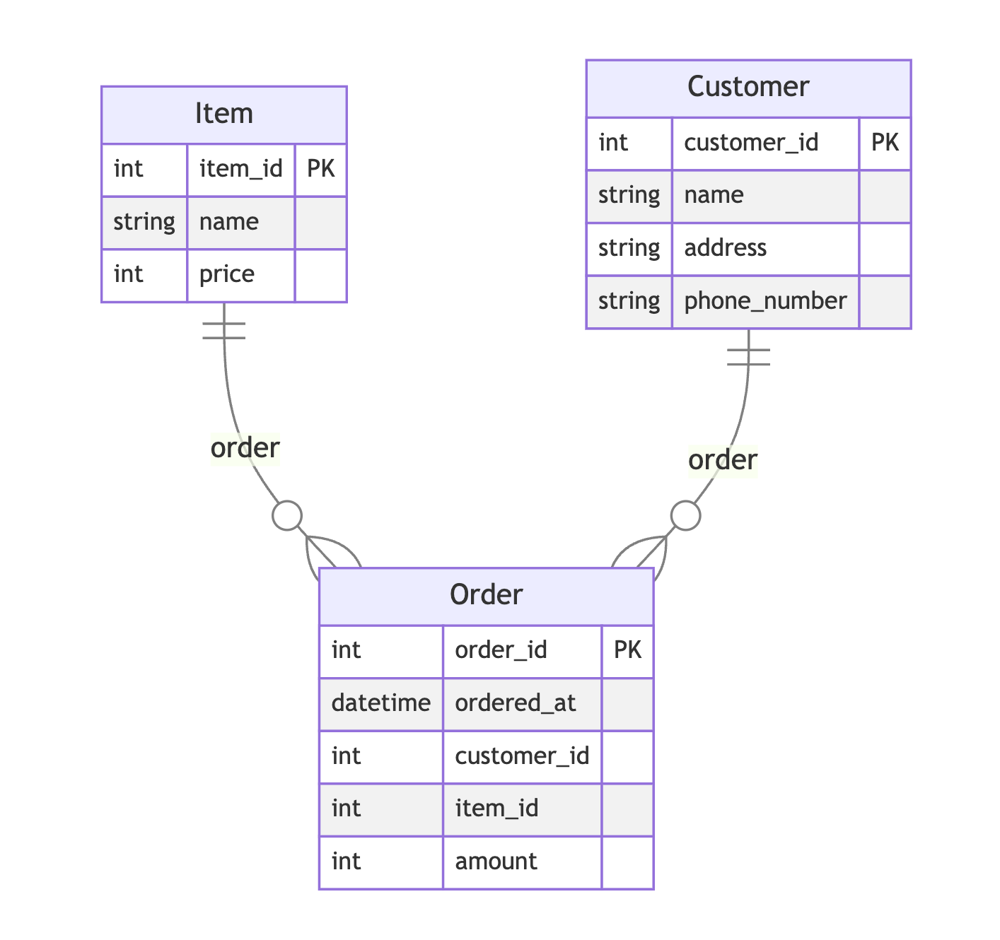

Rust をこれから大きく支えるかもしれない

# SeaQL Projects について

---

## このプレゼンテーションの目標

- SeaQL Projects という取り組みを知ってもらう。
- Sea 系のプロダクトが技術選定の候補にあがってくる状態にする。

---

## 免責

- 私は本番環境でこのプロダクトを利用したことがありません。

---

## SeaQL Projects とは

- 「SeaXXX」とつくクレート群の総称を yuki が勝手に呼んでいる。
- ORM やそれに関連する GraphQL、ストリーミング処理ライブラリ、デバッガーなどを作っている。
- 有名どころでは「SeaORM」がある。
- https://www.sea-ql.org/

---

## SeaQL Projects の製品群

- SeaORM / SeaORM X
- SeaQuery
- Seaography
- SeaStreamer
- FireDBG

---

## SeaORM / SeaORM X

- 一番知名度があるかもしれない、ORM のクレート。近年話題。
- MySQL、Postgres、SQLite に対応している。「X」の方は SQLServer 対応のもの。
- Rails の Active Record に使用感は近そうに感じる。

---

## SeaQuery

- SeaORM 内で使われているクエリビルダー。

---

## Seaography

- SeaORM で作ったモデルの機能を拡張して GraphQL 対応させることができる。
- async-graphql と SeaORM を元に作られている。

---

## SeaStreamer

- いわゆるストリーム処理を行えるようにするクレート。
- Kafka や Redis などをバックエンドとすることができる。

---

## SeaXXX 系に言えること

- 非同期処理対応がデフォルトでなされていて ◎。
- ドキュメントが充実している。
- 団体でメンテナンスしているので、これからもおそらくメンテナンスが続くだろうという期待を持てる。

---

## 今日は SeaORM を簡単にみていきます

---

## サンプルコード

https://github.com/yuk1ty/seaql-examples

---

## SeaORM

- Pros
  - 普通に実用的なデザインをしている。
  - Rust にはまだ数少ない O/R マッパーを利用できる。
  - sea-orm-cli と組み合わせるとマイグレーションもスムーズ。
- Cons
  - 手続き的マクロで生成される箇所のコンパイルエラーの読み解きが難しい。
    - Rust 1.78 から入った`#[diagnostic::on_unimplemented]`とかをもうちょっと活用してよくできるかも。期待。
  - ボイラープレート多い。
    - O/R マッパーはいろいろ設定が必要な手前、仕方ない気もする。

---

## SeaORM を使う

---

## 今回扱うモデル



---

## モデルの定義

- `Model`の定義、ならびに`DeriveEntityModel`から`Entity`を生成させる。
- `ActiveModel`関連の操作定義をする。
- `Related`を使って関係性（リレーション）を定義する。

---

## モデルの定義: customer モデルの定義

```rust
// src/customer.rs
use sea_orm::entity::prelude::*;

#[derive(Clone, Debug, PartialEq, DeriveEntityModel)]
#[sea_orm(table_name = "customers")]
pub struct Model {
    #[sea_orm(primary_key, auto_increment = true)]
    pub customer_id: i32,
    pub name: String,
    pub address: String,
    pub phone_number: String,
}

#[derive(Clone, Debug, EnumIter, DeriveRelation)]
pub enum Relation {
    #[sea_orm(has_many = "super::order::Entity")]
    Order,
}

impl Related<super::order::Entity> for Entity {
    fn to() -> RelationDef {
        Relation::Order.def()
    }
}

impl ActiveModelBehavior for ActiveModel {}
```

---

### エンティティとモデル

```rust
// DeriveEntityModelでカラムやプライマリキーに関する情報が埋め合わせされる。
#[derive(Clone, Debug, DeriveEntityModel)]
#[sea_orm(table_name = "customers")]
// 構造体の名前は`Model`じゃないとダメ。
pub struct Model {
    #[sea_orm(primary_key, auto_increment = true)]
    pub customer_id: i32,
    pub name: String,
    pub address: String,
    pub phone_number: String,
}

// insertやupdateなどのメソッドを生やしてくれる`ActiveModel`。
impl ActiveModelBehavior for ActiveModel {
    // ActiveModelBehaviorを使うと、保存や削除処理をする直前に、
    // たとえばバリデーションチェックなどの機構を挟み込むことができる。
    // 何もしない場合は空にしておく（飛ばすことはできない）。
}
```

---

## モデル定義: order モデルの定義

```rust
// src/order.rs
use sea_orm::entity::prelude::*;

#[derive(Clone, Debug, DeriveEntityModel)]
#[sea_orm(table_name = "orders")]
pub struct Model {
    #[sea_orm(primary_key, auto_increment = true)]
    pub order_id: i32,
    pub ordered_at: DateTime,
    pub customer_id: i32,
    pub item_id: i32,
    pub amount: u32,
}

#[derive(Clone, Debug, EnumIter, DeriveRelation)]
pub enum Relation {
    #[sea_orm(
        belongs_to = "super::customer::Entity",
        from = "Column::CustomerId",
        to = "super::customer::Column::CustomerId"
    )]
    Customer,
    #[sea_orm(
        belongs_to = "super::item::Entity",
        from = "Column::ItemId",
        to = "super::item::Column::ItemId"
    )]
    Item,
}

impl Related<super::customer::Entity> for Entity {
    fn to() -> RelationDef {
        Relation::Customer.def()
    }
}

impl Related<super::item::Entity> for Entity {
    fn to() -> RelationDef {
        Relation::Item.def()
    }
}

impl ActiveModelBehavior for ActiveModel {}
```

---

## モデルの定義: item モデルの定義

```rust
// src/item.rs
use sea_orm::entity::prelude::*;

#[derive(Clone, Debug, DeriveEntityModel)]
#[sea_orm(table_name = "items")]
pub struct Model {
    #[sea_orm(primary_key, auto_increment = true)]
    pub item_id: i32,
    pub name: String,
    pub price: u32,
}

#[derive(Clone, Debug, EnumIter, DeriveRelation)]
pub enum Relation {
    #[sea_orm(has_many = "super::order::Entity")]
    Order,
}

impl Related<super::order::Entity> for Entity {
    fn to() -> RelationDef {
        Relation::Order.def()
    }
}

impl ActiveModelBehavior for ActiveModel {}
```

---

## リレーションの定義

- customer と order は one-to-many の関係性にする。
- item と order は one-to-many の関係性にする。
- これを SeaORM 上で定義する。

---

## SeaORM でのリレーションの定義

- `Relation`という enum を定義する。
- `Related`トレイトを実装する。

---

## customer に実装する

```rust
#[derive(Clone, Debug, EnumIter, DeriveRelation)]
pub enum Relation {
    // customer -> orderに対する関係性を定義する。
    #[sea_orm(has_many = "super::order::Entity")]
    Order,
}

// customer::Entityに対して関係性情報を追加する。
impl Related<super::order::Entity> for Entity {
    fn to() -> RelationDef {
        Relation::Order.def()
    }
}
```

---

## item に実装する

- customer と同様。

```rust
#[derive(Clone, Debug, EnumIter, DeriveRelation)]
pub enum Relation {
    #[sea_orm(has_many = "super::order::Entity")]
    Order,
}

impl Related<super::order::Entity> for Entity {
    fn to() -> RelationDef {
        Relation::Order.def()
    }
}
```

---

## order に実装する

```rust
#[derive(Clone, Debug, EnumIter, DeriveRelation)]
pub enum Relation {
    // どのカラムをキーとしてマッピングさせるかを定義する。
    // itemとcustomerに対して定義する。
    #[sea_orm(
        belongs_to = "super::customer::Entity",
        from = "Column::CustomerId",
        to = "super::customer::Column::CustomerId"
    )]
    Customer,
    #[sea_orm(
        belongs_to = "super::item::Entity",
        from = "Column::ItemId",
        to = "super::item::Column::ItemId"
    )]
    Item,
}

// order::Entityとcustomer/item::Entityの関係性を定義する。
impl Related<super::customer::Entity> for Entity {
    fn to() -> RelationDef {
        Relation::Customer.def()
    }
}

impl Related<super::item::Entity> for Entity {
    fn to() -> RelationDef {
        Relation::Item.def()
    }
}
```

---

## テストを通じて使い方を確認する

本来は実データベースに接続すべきですが、時間と説明の都合モックの話を優先します 🙏🏻

- 生成された`Entity`から`find_by_id`などのデータベース操作関連の関数が生えているのを確認する。
- モックを使ったテストの仕方を確認する。

---

## テストコード

```rust
#[cfg(test)]
mod tests {
    use sea_orm::{entity::prelude::*, DatabaseBackend, MockDatabase};

    use crate::customer::Entity as CustomerEntity;
    use crate::{
        customer::Model as CustomerModel, item::Model as ItemModel, order::Model as OrderModel,
    };

    #[tokio::test]
    async fn test_find_item() -> Result<(), DbErr> {
        let db = MockDatabase::new(DatabaseBackend::Postgres)
            .append_query_results([vec![CustomerModel {
              /* 省略 */
            }]])
            .append_query_results([vec![ItemModel {
              /* 省略 */
            }]])
            .append_query_results([vec![OrderModel {
              /* 省略 */
            }]])
            .into_connection();

        assert_eq!(
            CustomerEntity::find_by_id(1).one(&db).await?,
            Some(CustomerModel {
              /* 省略 */
            })
        );

        Ok(())
    }
}
```

---

## テストコード

ポイントは次の通り。

- `Entity`から生えた`find_by_id`などの関数が見られる。
- `MockDatabase`、ならびに`append_query_results`を使ってテストデータをセットできる。

---

## CRUD 関数

- 生成した`Entity`に対して、`find`、`insert`、`update`、`delete`などの関数が生えてくる。
- これを使ってデータベース操作を行う。

```rust
CustomerEntity::find_by_id(1).one(&db).await?,
    Some(CustomerModel {
    /* 省略 */
})
```

---

## モックデータベースの定義

- `MockDatabase`ならびに付随する関数を利用して、モック用のデータを結構手軽にセットできる。便利。

```rust
let db = MockDatabase::new(DatabaseBackend::Postgres)
    .append_query_results([vec![CustomerModel {
      /* 省略 */
    }]])
    .append_query_results([vec![ItemModel {
      /* 省略 */
    }]])
    .append_query_results([vec![OrderModel {
      /* 省略 */
    }]])
    .into_connection();
```

---

## モックデータベースの定義

- 読み出しの場合は`append_query_results`を用いたが、書き込みの結果をモックさせる場合は`append_exec_results`という関数が使える。
- 書き込み時には、その他トランザクションログをテストする機構も用意されている。
- 詳しくはドキュメント https://www.sea-ql.org/SeaORM/docs/write-test/mock/ を参照できる。

---

## sea-orm-cliの機能

実務上便利かもしれない機能として下記がある。

- データベースマイグレーションをできる。
- 実テーブルの情報を読んでエンティティのコードを自動生成させられる（`sea-orm-cli generate entity`）。

---

## その他のSea系クレートとの連携

- Seaography: SeaORMで定義したモデルを使って、`seaography::register_entities!`マクロ経由でGraphQLスキーマを定義できる。
- SeaStreamer: SeaORMで定義したモデルを、ストリーム処理のシンクの対象（コンシューマ、あるいはデータの保存先）とすることができる。

---

## まとめ

- ORM を選ぶ必要が出てきたらぜひ検討してみたい。
- RDBMS との接続以外にも、GraphQL やストリーミング処理向けのクレートがある。
